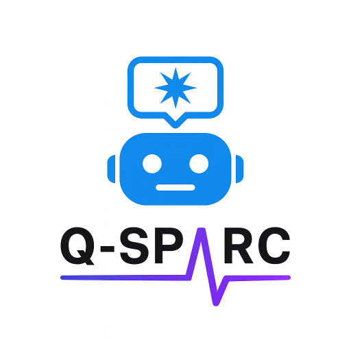
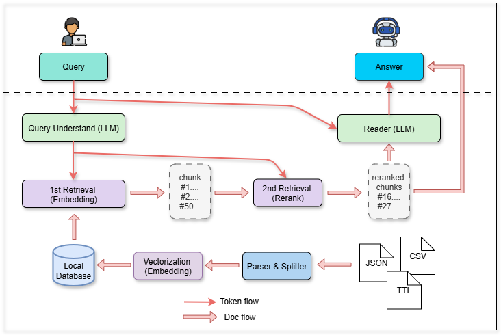

# Q-SPARC

An interactive Python chatbot for intuitive exploration of SCKAN and Flatmap.

[![Contributors][contributors-shield]][contributors-url]
[![Stargazers][stars-shield]][stars-url]
[![Issues][issues-shield]][issues-url]
[![GitHub issues-closed][issues-closed-shield]][issues-url]
[![License][license-shield]][license-url]
[![Contributor Covenant][code-of-conduct-shield]](CODE_OF_CONDUCT.md)
[![PyPI version fury.io][pypi-shield]][pypi-url]
[![Conventional Commits][conventional-commits-shield]][conventional-commits-url]

[contributors-shield]: https://img.shields.io/github/contributors/SPARC-FAIR-codeathon/Q-SPARC.svg?style=flat-square
[contributors-url]: https://github.com/SPARC-FAIR-codeathon/Q-SPARC/graphs/contributors
[stars-shield]: https://img.shields.io/github/stars/SPARC-FAIR-codeathon/Q-SPARC.svg?style=flat-square
[stars-url]: https://github.com/SPARC-FAIR-codeathon/Q-SPARC/stargazers
[issues-shield]: https://img.shields.io/github/issues/SPARC-FAIR-codeathon/Q-SPARC.svg?style=flat-square
[issues-url]: https://github.com/SPARC-FAIR-codeathon/Q-SPARC/issues
[issues-closed-shield]: https://img.shields.io/github/issues-closed/SPARC-FAIR-codeathon/Q-SPARC.svg
[issues-closed-url]: https://GitHub.com/SPARC-FAIR-codeathon/Q-SPARC/issues?q=is%3Aissue+is%3Aclosed
[license-shield]: https://img.shields.io/github/license/SPARC-FAIR-codeathon/Q-SPARC.svg?style=flat-square
[license-url]: https://github.com/SPARC-FAIR-codeathon/Q-SPARC/blob/master/LICENSE
[code-of-conduct-shield]: https://img.shields.io/badge/Contributor%20Covenant-2.1-4baaaa.svg
[pypi-shield]: https://badge.fury.io/py/{PYPI_PROJECT_NAME}.svg
[pypi-url]: https://pypi.python.org/pypi/{PYPI_PROJECT_NAME}}/
[conventional-commits-shield]: https://img.shields.io/badge/Conventional%20Commits-1.0.0-%23FE5196?logo=conventionalcommits&logoColor=white
[conventional-commits-url]: https://conventionalcommits.org

## Table of contents
* [About](#about)
* [Introduction](#Introduction)
* [The Problem](#The-Problem)
* [Our Solution](#Our-Solution)
* [Using Q-SPARC](#Using-Q--SPARC)
* [Contributing](#contributing)
* [Reporting issues](#reporting-issues)
* [Contributors](#contributors)
* [Acknowledgements](#acknowledgements)

## About

This is the repository of team **TBC** (Team G) of the 2025 SPARC Codeathon. Information about the 2025 SPARC Codeathon can be found [here](https://sparc.science/news-and-events/events/2025-sparc-fair-codeathon).

No work was done on this project prior to the Codeathon.

## Introduction

The NIH Common Fund's Stimulating Peripheral Activity to Relieve Conditions (SPARC) program aims to advance our understanding of how electrical signals regulate internal organ function. By investigating these mechanisms, SPARC explores the potential for therapeutic devices to modulate nerve activity as treatments for conditions such as hypertension, heart failure, and gastrointestinal disorders. This comprehensive research initiative has aggregated data from over 60 research groups, encompassing more than 3,900 subjects across 8 species and 49 different anatomical structures.

The SCKAN Natural Language Interface (SCKAN NLI, http://fdi-nlp.ucsd.edu/) is an AI-based query interface customized for retrieving high-level connectivity knowledge from SCKAN. The NLI leverages the GPT-4o mini ("o" for "omni") model to extract contextual semantic frames related to SCKAN's connectivity knowledge and generates answers using natural language expressions. The technical overview of the SCKAN NLI can be found [here](https://github.com/smtifahim/SCKAN-Apps/blob/master/sckan-explorer/json/sckan-nli/technical-overview.md).

Building on the limitations of the SCKAN NLI, we developed an interactive chatbot (Q-SPARC) designed to explore both SCKAN and Flatmap with a focus on enhancing user experience. The Q-SPARC provides a more intuitive and engaging way for users to access connectivity knowledge by leveraging natural language queries. By integrating advanced open-access large language models and visualization tools, it enables users to interactively navigate complex anatomical and neural connectivity data, offering a more seamless and informative exploration experience.

## The Problem

Large language models (LLMs) have revolutionized how users interact with complex scientific databases, offering the potential for intuitive, natural language queries that democratise access to specialised knowledge. However, the current SCKAN NLI implementation falls short of delivering an optimal user experience that could significantly enhance engagement with the broader SPARC Platform.

While the SCKAN NLI provides valuable functionality, several critical limitations prevent it from fully leveraging the power of modern LLMs and restrict user adoption across the SPARC ecosystem:

1. **Response Time**: This is an experimental service that relies on GPT-4o. The response time for the SCKAN NLI is primarily (>95%) dictated by GPT-4o's own response times.

2. **Lack of Conversational Memory & Limited Interactive Chatbot Functionality**: The chatbot cannot remember previous questions and functions more as a query tool than an interactive chatbot. This means users must phrase their entire query in a single turn, which makes the bot seem unintelligent. For example, if you ask it about the previous question, the SCKAN-NLI will give an unrelated answer. It is essentially a single-turn Q&A system rather than a conversational interface.

3. **Redundant Architecture**: The use of multiple API calls and multiple LLM calls makes the overall logic overly redundant and complex.

4. **Inability to Integrate Flatmap**: The system cannot be integrated with Flatmap.

5. **User Interface Limitations**: Doesn't include chat history.

These limitations create friction that discourages researchers from fully exploring SCKAN's rich connectivity data, ultimately reducing the scientific impact and utility of the entire SPARC.

## Our Solution 

We have developed a effective and extensible chatbot system(Q-SPARC) that integrates local LLM reasoning, structured data retrieval, and Flatmap anatomical visualization. By supporting multi-turn dialogue and a staged retrieval strategy, it improves query efficiency and relevance, provides natural language summaries and structured tabular outputs, and enables dynamic Flatmap rendering. 

This significantly enhances the accessibility and interpretability of SCKAN data within the SPARC ecosystem, aligning with SPARC’s **FAIR**ness principles by:

* **F**indability
   - Enhanced Metadata Management
By performing embedding-based retrieval and reranking of knowledge chunks, the system achieves precise search and automatically extracts and attaches rich metadata tags, helping users       quickly locate corresponding visualizations.
   - Keyword Tagging and Semantic Indexing
The system ranks semantically relevant content and tags it with keywords, improving search accuracy and efficiency, allowing users to swiftly find target data and related Flatmap            visualizations via natural language or keywords.
* **A**ccessibility
   - User-Friendly Interactive Interface
The local or cloud-based LLM server supports multi-turn dialogue and follow-up questions, significantly lowering the barrier for non-expert users, enabling intuitive natural language interaction and real-time data access.
   - Platform Compatibility
Designed as a modular, and extensible system, it accesses standardized local SDS datasets via APIs, ensuring smooth and efficient data retrieval.
   - Open Access and Unrestricted Usage
If the LLM system is open-source or freely available, it further guarantees broad community access, promoting fair sharing of SPARC data resources.
* **I**nteroperability
   - Support for Standard Formats
Supports import and export of open standard formats such as JSON, CSV, and TTL, ensuring compatibility with other research tools and analysis platforms and facilitating seamless integration of data and visualization outputs.
   - API-Driven and Modular Architecture
With well-designed API interfaces enabling dynamic interaction with the Flatmap server, the system supports integration with external toolchains, promoting cross-platform and cross-tool collaboration.
* **R**eusability
   - Comprehensive Documentation and Templates
Accompanied by detailed documentation and commonly used visualization templates, the system helps users quickly reuse and customize visualization solutions for their own datasets, reducing redundant development effort.

## Using Q-SPARC
Included are guided tutorials covering some applications of Q-SPARC:

<table>
<thead>
  <tr>
    <th> Tutorial</th>
    <th> Description</th>
  </tr>
</thead>
<tbody>
  <tr>
    <td><a href="tutorials/tutorial_1_getting_started.ipynb">
    Tutorial 1: 
    </a></td>
    <td> <b>Getting started</b> - In this tutorial, we show how to deploy Q-SPARC and use the basic example.</td>
  </tr>
  <tr>
    <td><a href="tutorials/tutorial_2_deploying_Q_SPARC_chatbot.ipynb">
    Tutorial 2: 
    </a></td>
    <td> <b>Deploying_Q-SPARC_chatbot</b> - In this tutorial, we show how to augmenting Q-SPARC with SCKAN dataset to provide expert natural language response and relevant metadata. </td>
  </tr>
  <tr>
    <td><a href="tutorials/tutorial_3_communication_frontend_backend.ipynb">
    Tutorial 3: 
    </a></td>
    <td> <b>Communication_frontend_backend</b> - In this tutorial, we show how the web-based UI interacts with Q-SPARC to display structured and unstructured outputs in a user-friendly way.</td>
  </tr>
  <tr>
    <td><a href="tutorials/tutorial_4_visualizing_results_with_flatmap.ipynb">
    Tutorial 4: 
    </a></td>
    <td> <b>Visualizing_results_with_flatmap</b> - In this tutorial, we show how to integrate the analysis results of Q-SPARC with Flatmap for dynamic anatomical visualization.</td>
  </tr> 
</tbody>
</table>

 

## Contributing

See [Contributing](CONTRIBUTING.md)

## Reporting issues 
To report an issue or suggest a new feature, please use the [issues page](https://github.com/GITHUB_ACCOUNT/{REPO_NAME}/issues). 
Please check existing issues before submitting a new one.

## Contributors

* [Matthew French](https://github.com/frenchmatthew) (Lead, SysAdmin)
* [Johnny Xu](https://github.com/JohnnyXu158) (Developer, Writer)
* [Yun Gu](https://github.com/greeyun) (Developer, Writer)
* [Dan Zhang](https://github.com/nailperry-zd) (Developer, Writer)
* [Huayan Zeng](https://github.com/huayan190) (Writer)

## Acknowledgements 
- We would like to thank the  2025 SPARC Codeathon organizers for their guidance and support during this Codeathon.

